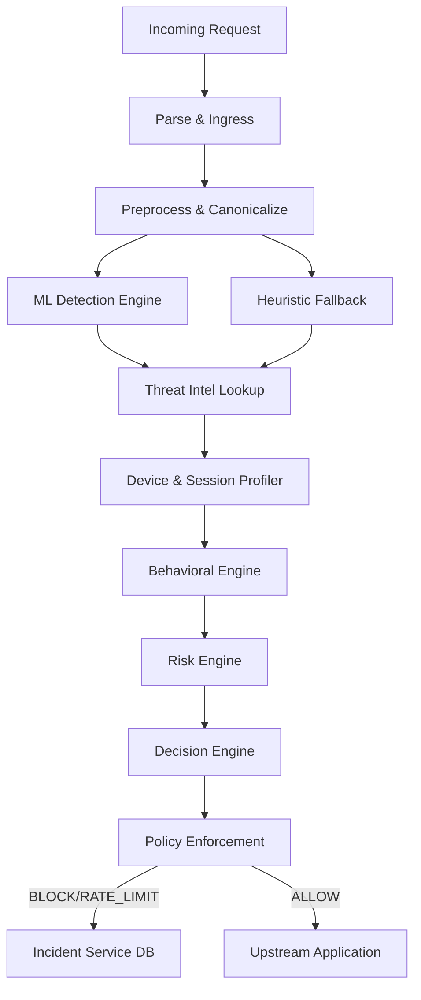

# Adaptive Security Gateway & ML Detector

An intelligent, real-time Adaptive Security Gateway designed to detect and block SQL Injection (SQLi) and Cross-Site Scripting (XSS) attacks. Powered by a Deep Learning model built with PyTorch and a robust 14-stage inspection pipeline, this gateway provides enterprise-grade application security with automated risk scoring and incident management.

---

## 📖 Overview

The Adaptive Security Gateway sits in front of your web applications, intercepting traffic to inspect payloads for malicious intent. Unlike traditional WAFs that rely solely on static signatures, this system leverages a character-level neural network to understand context and detect evasive payloads. It pairs this ML engine with device profiling, behavioral analysis, and threat intelligence to compute a dynamic risk score, ensuring a highly accurate security posture with minimal false positives.

---

## ✨ Features

- **Deep Learning Detection:** Custom PyTorch neural network trained for high-confidence SQLi and XSS identification.
- **14-Stage Inspection Pipeline:** Modular request processing including canonicalization, device profiling, session tracking, and threat intelligence integration.
- **Dynamic Risk Engine:** Calculates real-time risk scores based on ML confidence, IP reputation, and anomalous behavioral patterns.
- **Fail-Closed Security Posture:** Built-in heuristic signature fallbacks guarantee protection even if the ML model is offline or degraded.
- **SOC Dashboard:** A modern React + Vite frontend for analysts to triage incidents, monitor traffic, and review blocked requests.
- **Graceful Degradation:** Automatic fallback from MongoDB to in-memory storage if the database becomes unreachable.
- **Incident Management API:** RESTful endpoints to query, filter, and update incident statuses (e.g., True/False Positive resolutions).

---

## 🛠 Tech Stack

### Core & Backend
- **Python** 3.9+
- **Flask** (>=2.3.0) — API framework
- **PyMongo** — Database driver for MongoDB
- **Pytest & Flake8** — Testing and Code Quality

### Machine Learning
- **PyTorch** (>=2.0.0) — Core deep learning framework
- **Scikit-learn, Pandas, NumPy** — Data preprocessing and evaluation

### Frontend (SOC Dashboard)
- **React** (18.2.0)
- **Vite** (4.4.0) — Build tool and dev server
- **Lucide React** — Iconography

---

## 🏗 Architecture Overview

The gateway operates on a modular pipeline architecture. Every incoming request passes through 14 distinct stages before a final policy decision (`ALLOW`, `MONITOR`, `RATE_LIMIT`, or `BLOCK`) is reached.



---

## 📂 Project Structure

```text
sqli-xss-ml-detector/
├── dashboard/               # React + Vite SOC Dashboard
│   ├── src/                 # Frontend components and pages
│   ├── package.json         # Node dependencies
│   └── vite.config.js       # Vite configuration
├── gateway/                 # Flask Security Gateway
│   ├── pipeline/            # 14-stage security inspection modules
│   ├── routes/              # API controllers (predict, incidents)
│   ├── services/            # Database and incident logging services
│   └── app.py               # Flask application factory
├── ml/                      # PyTorch Machine Learning module
│   ├── artifacts/           # Trained models and vocabularies
│   ├── data/                # Training datasets
│   ├── model.py             # Neural network architecture definition
│   ├── inference.py         # Real-time inference logic
│   └── train.py             # Model training routines
├── scripts/                 # Utility scripts
│   └── attack_simulation.py # Automated payload evasion testing
├── docs/                    # Project documentation & UAT reports
├── requirements.txt         # Python dependencies
└── .env.example             # Environment variable templates
```

---

## 🚀 Installation

### Prerequisites
- Python 3.9 or higher
- Node.js 18+ (for Dashboard)
- MongoDB (Local or Atlas, optional but recommended)

### 1. Clone the Repository
```bash
git clone https://github.com/saichetanM98/sqli-xss-ml-detector.git
cd sqli-xss-ml-detector
```

### 2. Backend Setup (Gateway & ML)
```bash
# Create and activate virtual environment
python -m venv .venv
# On Windows:
.venv\Scripts\activate
# On Linux/macOS:
# source .venv/bin/activate

# Install dependencies
pip install -r requirements.txt
```

### 3. Frontend Setup (Dashboard)
```bash
cd dashboard
npm install
cd ..
```

---

## ⚙️ Configuration

Copy the example environment file and configure it to suit your deployment.

```bash
cp .env.example .env
```

### Environment Variables

| Variable | Required | Default | Purpose |
|----------|----------|---------|---------|
| `PORT` | No | `5000` | Port for the Flask gateway API |
| `FLASK_ENV` | No | `development` | Environment mode (`development` or `production`) |
| `SECRET_KEY` | Yes | `dev-secret-key...` | Cryptographic key for session security |
| `MONGO_URI` | No | `mongodb://localhost:27017...` | MongoDB connection string |
| `MODEL_PATH` | No | `ml/artifacts/best_model.pt` | Path to the PyTorch ML checkpoint |
| `VOCAB_PATH` | No | `ml/artifacts/vocab.json` | Path to the character vocabulary mapping |
| `RISK_THRESHOLD_BLOCK`| No | `80` | Risk score threshold to trigger an outright block |
| `RISK_THRESHOLD_MONITOR`| No | `40` | Risk score threshold to trigger monitoring |

---

## 🏃 Running the Project

### 1. Start the Security Gateway
From the root directory with your virtual environment activated:
```bash
python -m gateway.app
```
*The API will be available at `http://localhost:5000`*

### 2. Start the SOC Dashboard
Open a new terminal window:
```bash
cd dashboard
npm run dev
```
*The dashboard will be available at `http://localhost:5173`*

---

## 📜 Available Scripts

### Node Scripts (in `/dashboard`)
- `npm run dev`: Starts the Vite development server.
- `npm run build`: Compiles the React application for production deployment.
- `npm run preview`: Locally previews the production build.

### Python Scripts
- `python scripts/attack_simulation.py`: Fires a suite of evasive SQLi and XSS payloads at the local gateway to verify detection accuracy and rate-limiting responses.

---

## 🔌 API Documentation

### 1. Request Inspection
`POST /predict`
Inspects an incoming HTTP payload through the security pipeline.
**Payload:**
```json
{
  "payload": "admin' OR 1=1--",
  "ip": "192.168.1.100",
  "headers": {
    "User-Agent": "Mozilla/5.0..."
  }
}
```
**Response:**
```json
{
  "status": "success",
  "label": "sqli",
  "confidence": 0.998,
  "risk_level": "CRITICAL",
  "verdict": "BLOCK",
  "risk_score": 95.5,
  "incident_id": "64f1a2b3...",
  "latency_ms": 12.4
}
```

### 2. Incident Management
`GET /api/incidents`
Retrieve a paginated list of blocked or monitored requests. Supports query parameters for filtering (`?verdict=BLOCK&attack_type=sqli&limit=50`).

`POST /api/incidents/<id>/status`
Update the status of an incident for SOC triage.
**Payload:**
```json
{
  "status": "TRUE_POSITIVE",
  "notes": "Verified evasive payload attempt."
}
```

### 3. System Health
`GET /health`
Returns the status of the gateway, ML model memory state, CUDA availability, and database connectivity.

---

## 🗄 Database

The application utilizes MongoDB to persist security incidents. 

**Collections:**
- `incidents`: Stores detailed telemetry of flagged requests, including ML confidence, behavioral metrics, extracted payloads, and triage status.

*Note: The `gateway/services/db.py` module features a graceful fallback mechanism. If MongoDB is unreachable, the system reverts to an in-memory storage array to ensure uninterrupted protection.*

---

## 🧪 Testing

The repository includes a comprehensive testing suite.
To run the automated test suite:
```bash
pytest gateway/tests ml/tests --cov=gateway --cov=ml
```

To manually verify evasion protection against the running gateway:
```bash
python scripts/attack_simulation.py
```

---

## 🔒 Security & Architecture Decisions

1. **Character-level Neural Network:** Traditional tokenizers fail against obfuscated SQLi (e.g., `/*!50000SeLeCt*/`). A character-level vocabulary forces the model to understand structural anomalies rather than exact keywords.
2. **Fail-Closed Heuristics:** If the PyTorch model fails to load or inference times out, the `inference.py` engine automatically falls back to strict heuristic regex evaluations, preventing traffic bypasses during degraded states.
3. **Decoupled Risk vs. Detection:** The ML engine only classifies payloads. The `Policy Engine` interprets these classifications alongside Threat Intel and Behavior metrics to make the final `ALLOW`/`BLOCK` decision.

---

## 👥 Authors & Team Details

Developed as part of the **Mini Project (BCY586) — 2026**.

- **Saichetan M** (USN: 1RN24CY040)
- **Vishwanath** (USN: 1RN24CY053)
