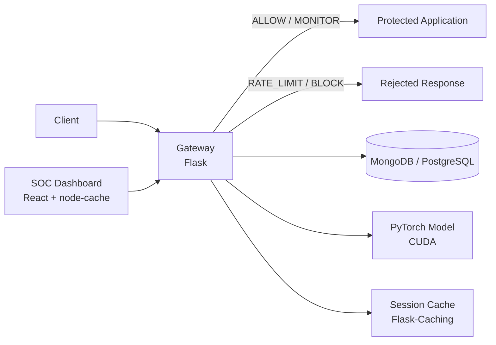
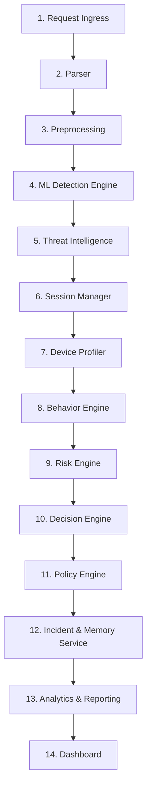
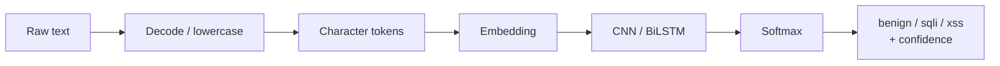
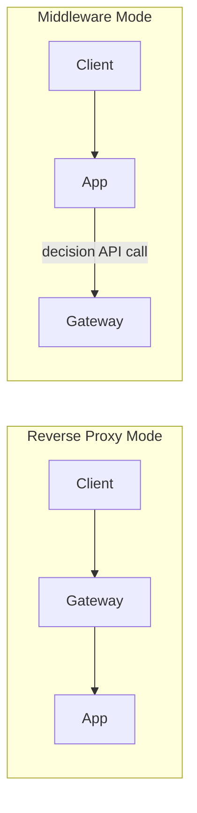

# Architecture
## Adaptive Security Gateway

This document describes how the system is structured and how a request moves through it. For the full requirement list see the SRS; for technology choices see `Tech_Stack.md`.

---

## 1. System Overview

The gateway sits between a client and a protected web application. Every request is parsed, classified by a deep learning model, enriched with context, scored for risk, and given a verdict before it reaches the application.

**Main components**

| Component | Technology | Role |
|---|---|---|
| Gateway | Flask (Python) | Runs stages 1-13 of the pipeline and exposes the API |
| Detection model | PyTorch, CUDA-enabled | Character-level CNN/BiLSTM classifier: benign / SQLi / XSS |
| Session cache | Flask-Caching (SimpleCache) | Server-side session and rate-limit state |
| Data store | MongoDB or PostgreSQL | Incidents, sessions, devices, attacker memory, model versions |
| Dashboard | React + node-cache | Analyst UI for review, replay, and override |

---

## 2. Request Pipeline (14 Stages)

| # | Stage | Responsibility |
|---|---|---|
| 1 | Request Ingress | Accept traffic in reverse-proxy or middleware mode |
| 2 | Parser | Normalize method, path, headers, cookies, body, query params, client IP |
| 3 | Preprocessing | Decode URL/HTML encoding, lowercase, tokenize at character level |
| 4 | ML Detection Engine | Classify each input field and return a label plus confidence (0-1) |
| 5 | Threat Intelligence | IP reputation, GeoIP/ASN enrichment |
| 6 | Session Manager | Per-session request counts, endpoints visited, duration |
| 7 | Device Profiler | SHA-256 fingerprint from header combinations |
| 8 | Behavior Engine | Anomaly scoring: request rate, enumeration, multiple attack types, long sessions |
| 9 | Risk Engine | Weighted fusion of ML confidence, behavior score, and reputation into a 0-100 score |
| 10 | Decision Engine | Map score to ALLOW / MONITOR / RATE_LIMIT / BLOCK |
| 11 | Policy Engine | Hard overrides for critical cases regardless of score |
| 12 | Incident & Memory Service | Persist flagged requests; update attacker memory by IP/device |
| 13 | Analytics & Reporting | Aggregate trends and attack-type breakdowns |
| 14 | Dashboard | Analyst review, replay, confirm/override verdicts |

---

## 3. Detection Engine (Stage 4)

- Model: character-level CNN or BiLSTM in PyTorch, trained on labeled SQLi, XSS, and benign text
- Input: preprocessed, character-tokenized field text
- Output: predicted class and confidence score, passed to the Risk Engine
- Runtime: CUDA-enabled GPU; the gateway checks `torch.cuda.is_available()` at startup and warns if it falls back to CPU
- The model is the only detector; there is no classical ML or regex fallback
- Artifacts (`model.pt`, `vocab.json`) are versioned and recorded in `model_versions` so a bad model can be rolled back

**Offline training** is a separate workflow: load datasets, preprocess, train on GPU, evaluate (accuracy, precision, recall, F1, confusion matrix), export the artifact. The gateway only loads the exported artifact at runtime.

---

## 4. Risk and Decision Logic (Stages 8-11)

**Behavior score rules**

| Rule | Condition | Points |
|---|---|---|
| High request rate | request count > 100 | +20 |
| New/unknown device | device not seen before | +10 |
| Multiple attack types | 2+ types from one source | +20 |
| Long session | session > 3600 s | +10 |
| Endpoint enumeration | > 20 unique endpoints | +20 |
| Known malicious IP | prior confirmed attacks | +30 |
| Attack detected | any ML-flagged attack this request | +20 |

**Risk score:** weighted combination of ML confidence, behavior score, and reputation, capped at 100.

**Decision bands:** low -> ALLOW, medium -> MONITOR, high -> RATE_LIMIT, critical -> BLOCK.

**Policy overrides (applied last)**

| Condition | Forced result |
|---|---|
| High-confidence SQL Injection | BLOCK |
| High-confidence XSS | RATE_LIMIT |
| SQL Injection + repeat offender | BLOCK |
| Known-malicious IP | BLOCK |

Thresholds and weights live in `config.py` so they can be tuned without code changes.

---

## 5. Caching Design

Two caches exist for different purposes and must not be merged.

| | Session Manager (Stage 6) | Dashboard UI cache |
|---|---|---|
| Runs in | Flask process (server) | Local Node process (localhost) |
| Technology | Flask-Caching, SimpleCache | node-cache |
| Purpose | Track requester behavior for rate-limiting and anomaly scoring | Make the dashboard responsive (last-fetched lists, filters) |
| Security-relevant | Yes | No |
| Client-controllable | Never | N/A |

Session state stays server-side because the entity being tracked may be the attacker; if a client could clear it, they could reset their own rate limit. SimpleCache is per-process, so the gateway runs as a single Flask process, which fits the localhost, up-to-~1,000-user scope.

---

## 6. Deployment Modes

- **Reverse proxy:** the gateway receives traffic first and forwards allowed requests upstream
- **Middleware:** the application calls the gateway's decision API for each request and obeys the verdict
- **Fail closed:** in middleware mode, if the gateway, model, or GPU is unavailable, the request is rejected or flagged rather than allowed
- Everything runs directly on the host: one Flask process plus a local Node process for the dashboard. No containers.

---

## 7. Data Stores

| Store | Purpose |
|---|---|
| `incidents` | Each flagged request: verdict, risk score, attack type, timestamp, context |
| `sessions` | Per-session state: request counts, endpoints visited, duration |
| `devices` | Device fingerprints, first/last seen, request counts |
| `security_memory` | Long-term attacker memory keyed by IP/device |
| `model_versions` | Model version, training date, validation metrics |

All database access goes through the service layer, using parameterized queries only.

---

## 8. API Surface

| Endpoint | Method | Purpose |
|---|---|---|
| `/predict` | POST | Classify input; return label and confidence |
| `/incidents` | GET | List logged incidents for the dashboard |
| `/incidents/<id>/override` | POST | Confirm or override a verdict |
| `/analytics/summary` | GET | Aggregated trends and attack-type breakdown |

---

## 9. Request Lifecycle

1. A request reaches the gateway (reverse proxy or middleware mode)
2. The parser builds a normalized request object
3. Preprocessing decodes and tokenizes every input field
4. The model scores each field for SQLi/XSS
5. Threat intel, session, and device context are gathered
6. The behavior engine scores anomalies
7. The risk engine fuses all signals into one score
8. The decision engine picks a verdict
9. The policy engine applies hard overrides
10. Flagged requests are persisted and attacker memory is updated
11. Allowed requests are forwarded; others get a block or rate-limit response
12. Incidents appear on the dashboard for analyst review

---

## 10. Design Decisions

| Decision | Reason |
|---|---|
| Deep learning only (PyTorch), no classical baseline | Learns payload patterns directly from raw text; GPU makes training and inference fast enough |
| Session state server-side only | Client-held state could be reset by an attacker |
| Two separate caches | Only one of them is security-relevant |
| Fail closed | A security control that fails open provides no protection during an outage |
| Policy overrides after scoring | Critical attack types must always be blocked, regardless of the blended score |
| No Docker, no retraining pipeline | Out of scope for a localhost, single-instance version |

---

## 11. Out of Scope (This Version)

- Attack types beyond SQLi and XSS (command injection, CSRF, SSRF are future extensions)
- Continuous or automatic model retraining
- Containerized deployment and high-availability clustering
- Scale beyond roughly 1,000 users on a single instance
