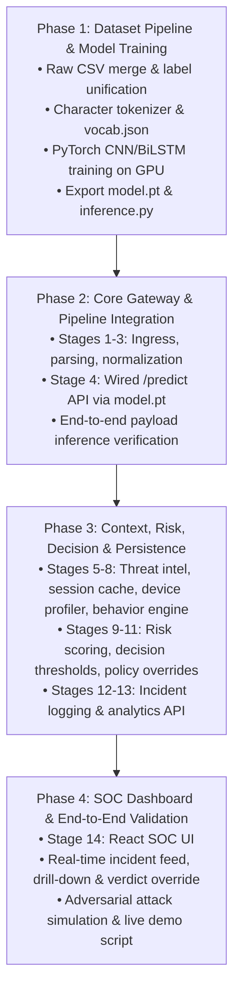

# Implementation Plan & Roadmap: AI-Based Adaptive Security Gateway

AI-powered security gateway for real-time SQL Injection and XSS detection using PyTorch, Flask, and React.

---

## 1. Architectural Build Order & Dependencies

---

## 2. Phase-by-Phase Breakdown

### Phase 1: Data Preparation & Model Training (Current Priority)
**Goal:** Produce a validated PyTorch character-level classifier checkpoint (`model.pt`) and character vocabulary (`vocab.json`).

1. **Step 1.1 — Inspect & Unify Datasets**
   - Source CSV files in `datasets/`: `SQLiV3.csv`, `XSS_dataset.csv`, `sqli.csv`, `sqliv2.csv`.
   - Harmonize columns across disparate schemas to `(payload: str, label: int)` where:
     - `0`: Benign
     - `1`: SQL Injection (`sqli`)
     - `2`: Cross-Site Scripting (`xss`)
   - Deduplicate and balance payload distributions.

2. **Step 1.2 — Tokenization & Vocabulary Generation**
   - Extract character vocabulary across train split with `<PAD>` (index 0) and `<UNK>` (index 1).
   - Save vocabulary to `ml/artifacts/vocab.json`.
   - Implement fixed-length character padding/truncation (default: 256 tokens).

3. **Step 1.3 — PyTorch Dataset & DataLoader Pipeline**
   - Test `PayloadDataset` in `ml/data/dataset.py` with 80/10/10 Train/Validation/Test split.
   - Verify GPU acceleration via `torch.cuda.is_available()`.

4. **Step 1.4 — Model Training & Checkpoint Export**
   - Train `PayloadClassifier` (1D CNN feature extractor + Bidirectional LSTM + Linear classification head).
   - Compute metrics on held-out test split: Accuracy, Precision, Recall, F1-Score, and Confusion Matrix.
   - Save top-performing weights to `ml/artifacts/best_model.pt`.
   - Expose `ml/inference.py::predict(text) -> Tuple[label, confidence]`.

---

### Phase 2: Core Gateway & `/predict` Endpoint
**Goal:** Build the HTTP ingress layer and verify live inference on incoming payloads.

1. **Step 2.1 — Ingress & Parser (Stages 1–2)**
   - Complete `gateway/pipeline/parser.py` to extract URL parameters, request body, headers, and client IP.
2. **Step 2.2 — Preprocessing & Decoding (Stage 3)**
   - URL-decode (`unquote_plus`), HTML-unescape, and strip whitespace in `gateway/pipeline/preprocess.py`.
3. **Step 2.3 — ML Inference Integration (Stage 4)**
   - Connect `gateway/pipeline/detection.py` to load `ml/artifacts/best_model.pt` and `vocab.json`.
   - Validate fallback behavior if the model is unreachable (fail-closed posture).
4. **Step 2.4 — Verification via `/predict` API**
   - Verify the POST `/predict` endpoint returns accurate labels (`benign`, `sqli`, `xss`) and confidence scores for test vectors.

---

### Phase 3: Context Enrichment, Risk Scoring & Incident Persistence
**Goal:** Wrap the ML core with behavioral context and policy enforcement.

1. **Step 3.1 — Contextual Enrichment (Stages 5–7)**
   - **Stage 5 (Threat Intel):** IP reputation tracking and private/local network detection (`threat_intel.py`).
   - **Stage 6 (Session Manager):** Server-side sliding-window rate tracking (Flask-Caching / SimpleCache) in `session_manager.py`.
   - **Stage 7 (Device Profiler):** Header combination hashing (SHA-256) and automated scanner detection (`sqlmap`, `nikto`, `curl`) in `device_profiler.py`.
2. **Step 3.2 — Behavioral & Risk Engines (Stages 8–9)**
   - **Stage 8:** Anomaly scoring for high request velocity, scanner user-agents, and repeated attacks (`behavior_engine.py`).
   - **Stage 9:** Weighted risk score formula:
     $$\text{Risk} = \min(100, (\text{ML\_Score} \times 0.70) + (\text{Threat\_Intel} \times 0.15) + (\text{Behavior} \times 0.15))$$
3. **Step 3.3 — Decision & Policy Engines (Stages 10–11)**
   - **Stage 10 (Decision):** Threshold mapping (Low: `ALLOW`, Medium: `MONITOR`, High: `BLOCK`).
   - **Stage 11 (Policy Overrides):** Hard policy enforcement (e.g., rate violation $\rightarrow$ `RATE_LIMIT`; high-confidence SQLi $\rightarrow$ `BLOCK`).
4. **Step 3.4 — Persistence & Analytics (Stages 12–13)**
   - Record flagged events in MongoDB/PostgreSQL or structured JSON store (`incident_service.py`).
   - Provide summary query endpoints for threat statistics (`analytics_service.py`).

---

### Phase 4: SOC Dashboard & End-to-End Validation
**Goal:** Deliver the web interface for incident review, replay, and live demonstration.

1. **Step 4.1 — SOC Dashboard (React + Vite)**
   - Implement incident feed with filtering by verdict (`BLOCK`, `MONITOR`, `RATE_LIMIT`), severity, and attack type.
   - Incident drill-down modal showing request headers, raw payload, model confidence, and risk breakdown.
   - Analyst override control (allows security analysts to mark false positives / true positives).
2. **Step 4.2 — End-to-End Testing & Hardening**
   - Test edge-case evasion attempts (double URL encoding, SQL comments, script tags in headers).
   - Ensure rate-limit security cannot be bypassed by client manipulation.
3. **Step 4.3 — Demo Preparation & Presentation**
   - Create automated curl/Postman attack scripts demonstrating:
     1. Benign request $\rightarrow$ `ALLOW` (HTTP 200)
     2. Suspicious request $\rightarrow$ `MONITOR` (HTTP 200 logged)
     3. High-volume burst $\rightarrow$ `RATE_LIMIT` (HTTP 429)
     4. SQLi / XSS attack $\rightarrow$ `BLOCK` (HTTP 403)

---

## 3. Immediate Action Items

| Priority | Task | Command / Action |
|:---:|---|---|
| **P0** | Inspect dataset schemas | Run dataset cleaning script on `datasets/*.csv` |
| **P1** | Generate character vocabulary | Export `ml/artifacts/vocab.json` |
| **P2** | Train initial baseline model | Run `python ml/train.py` (GPU/CPU) |
| **P3** | Test `/predict` endpoint | Validate live output against test payloads |
